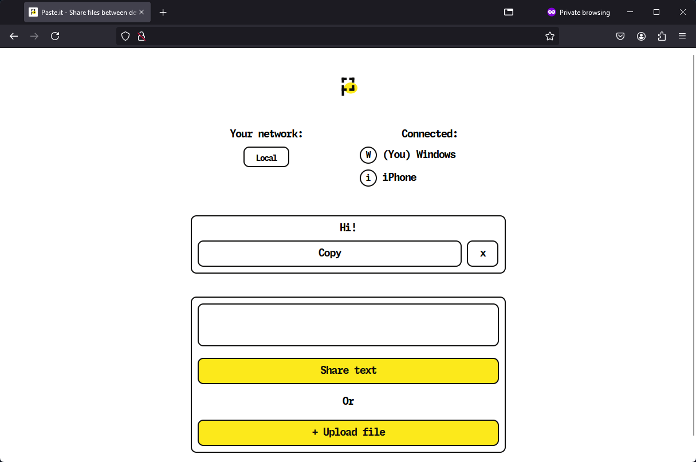
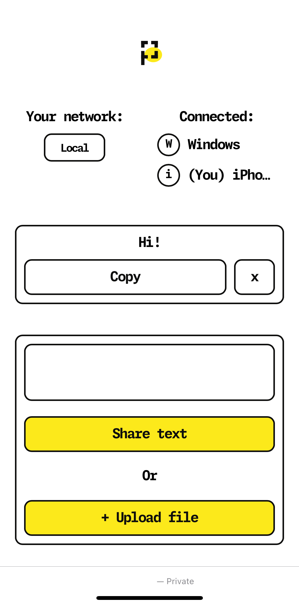

# Paste.it - shares files between same network
Paste.it is a simple file sharing service that allows you to share files between devices on the same network.
For example, if you want to share text or file between your laptop and mobile.<br/>
Each file maximum size is 50MB.

### Screenshots
<table>
  <tr>
    <td>Desktop (Windows)</td>
    <td>Mobile (iPhone)</td>
  </tr>
  <tr>
    <td></td>
    <td></td>
  </tr>
 </table>

## Getting Started
Required environment variables:

| Name                  | Description         | Example      |
|-----------------------|---------------------|--------------|
| `NODE_ENV`            | Node.js environment | `production` |
| `HOSTNAME` (optional) | Hostname server     | `0.0.0.0`    |
| `PORT` (optional)     | HTTP Server port    | `5000`       |

Then you can run the service with the following command:
```shell
$ docker-compose up --build
```

## License
This project is licensed with GNU AGPL v3 License.</br>
See [LICENSE](./LICENSE) for more details.
